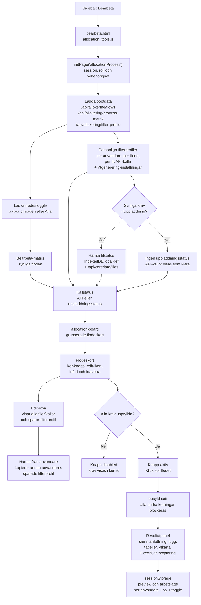
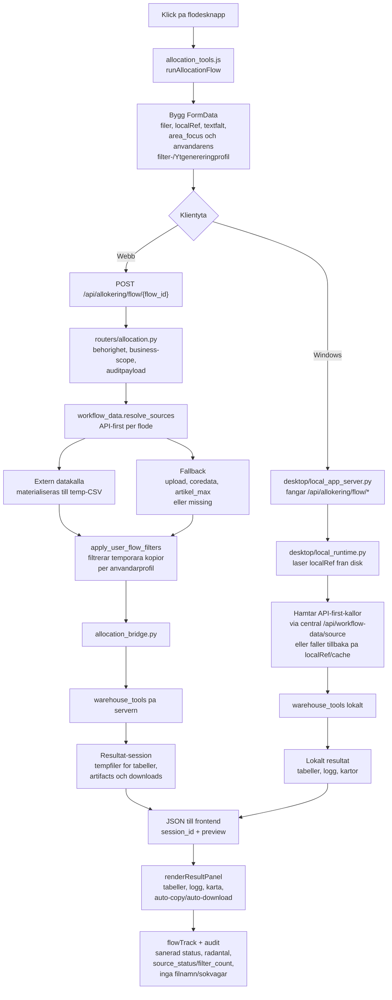
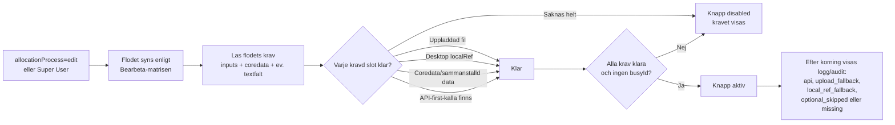
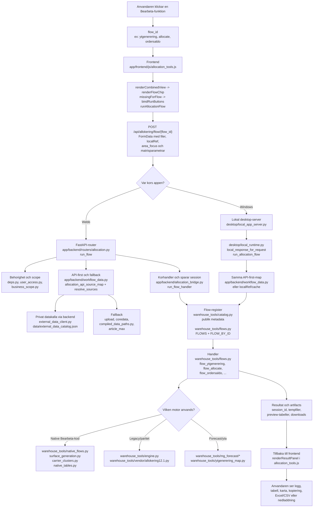

# Lagerverktyg

Kort svar: Lagerverktygen ar fyra vyer ovanpa `warehouse_tools`: Uppladdningar for filval, Bearbeta for floden, Installningar for lager-/ytkarta, Bearbeta-matris och bemanningsinstallningar samt Dela for listdelning. I webben sparas vanliga filval i IndexedDB och skickas som uploads nar servern behover dem. I Windows-appen sparas i stallet lokala filreferenser for Bearbeta och Produktivitetens filhantering. Bearbeta kan koras lokalt mot filerna pa disk, medan Produktivitetens personrapport proxas fran central `/api/productivity` nar servern ar nabar. Ovriga vyer fortsatter ga mot central server. Bearbeta och Dela behaller faltvarden, status och senaste resultat i aktuell browser-/desktop-session nar anvandaren byter vy och kommer tillbaka.

## Vyer

| Vy | Fil | Syfte | Behorighet |
| --- | --- | --- | --- |
| Uppladdningar | `uppladdningar.html` | Lagg in ASK/WMS/Excel-filer i lokalt filpool | `allocationUploads` |
| Bearbeta | `bearbeta.html` | Kor kombinerade lagerfloden som Allokering, Ordersaldo, kontroller | `allocationProcess` |
| Installningar | `installningar.html` | Bygg vidare Ytgenereringens UTL-karta och kapacitet, styr Bearbeta-matrisen och hantera Bemanning-flikens historiktimmar | `allocationSettings`, `allocationProcessMatrix`, `staffingSettings` |
| Dela | `dela.html` | Dela lang lista i kolumner | `allocationSplit` |

## Gemensamma filkontroller

| Kontroll | Vad anvandaren gor | Vad systemet gor | API/kod | Vanliga fel |
| --- | --- | --- | --- | --- |
| Valj filer | Valjer en eller flera filer | Webben identifierar filtyp och sparar filen i IndexedDB; Windows registrerar lokal path som `localRef` med metadata | `routeAllocationFiles`, `DesktopFileBridge` | Okand filtyp om namn/header inte matchar. |
| Drag-drop | Drar filer till panel/slot/flode | Samma som Valj filer, med fallback till slot. I Windows registreras filerna snabbt och tung sync sker koat | `routeAllocationFiles` | Om flera filer okanda visas toast "Kunde inte sortera". |
| Välj per slot | Valjer fil for en specifik slot | Forsoker detektera men fallbackar till sloten | `fallbackSlotKey` | Bra nar automatisk identifiering missar. |
| Ladda ner/Oppna | Klickar explicit filatgard | Webben laddar ned sparad fil forst vid klick; Windows oppnar lokal fil eller mapp via desktop bridge | `data-download-*`, `/api/desktop/files/{ref}/open` | Ingen fil hamtas eller lases i forvag bara for att listan visas. |
| X per slot | Rensar slot | Tar bort lokal IndexedDB-post eller lokal referens | `deleteAllocationFile` | Sammanstalld data som `artikel_max.csv` kan laddas ned utan att vara uppladdad i sessionen. |
| Rensa alla | Rensar vanliga lokala filval | Tar bort icke-skyddade filer ur allokeringsstore, men bevarar karnfiler och sammanstalld data som `artikel_max.csv` | `clearAllUploadedFiles` | Bekraftelse sager att karnfiler och sammanstalld data ligger kvar. |
| Uppladdningsbadge | Visar antal nya filer | Lagrar notice i sessionStorage | `allocationUploadActivity` | Badge rensas nar Uppladdningar oppnas. |

## Karnfiler och sammanstalld data

Uppladdningar visar separata listor for permanenta karnfiler och sammanstalld data. Vanliga filrader visar alltid det svenska vy-/slotnamnet fran filkunskapens `label_sv` som fet rubrik, sa tekniska alias som `customer_order_details_all` visas som `Detalj Kundorder (Alla)` och `v_ask_booking_putaway` visas som `Ej Inlagrade Artiklar`. Prognosfil, Kampanjfil och Textfil med varden ar Flow-egna namn och normaliseras inte mot filkunskapen. `artikel_max.csv` ar sammanstalld data och uppdaterar samma verksamhetsfil som Ordersaldo, LYX och Pafyllnadsprio anvander. Coredata-prefixen `custom`, `dimension`, `dispatch_template`, `item`, `item_alias`, `item_attribute`, `item_option`, `item_security_info`, `location`, `location_cost`, `pallet_type` och `trans_agency` sparas som blobbar i Postgres-tabellen `coredata_files` med unik nyckel per verksamhet och filtyp. KPI-mal hanteras separat via `v_ask_kpi_target`/`kpi`. `trans_agency` ar transportors-/agency-karnfilen och kan aven laddas upp med filnamn som borjar pa `transportorer`, `transportor` eller `agency`. Om en anvandare laddar upp en ny fil med samma prefix for sin verksamhet ersatts DB-raden och den nya blir sanningen for alla anvandare i verksamheten. Andra verksamheters filer rors inte. Gamla filer under `data/coredata/<verksamhetskod>/` kan fortfarande lasas som fallback tills de laddas upp igen.

Uppladdningar forhandsvisar inte langre filinnehall. Fyllda filrader visar bara metadata och explicita atgarder: `Ladda ner` for web/serverlagrade filer och `Oppna fil`/`Mapp` for Windows-local refs. Det gor att listan kan visas utan att ladda ned eller lasa alla filer i forvag.

Allokering anvander verksamhetens `item_option`-karnfil nar anvandaren inte laddat upp en egen Item Option-fil. En uppladdad lokal fil i sloten vinner for den korningen, men den permanenta karnfilen ligger kvar som verksamhetens fallback.

Ytgenerering ar nu den publika enknappsvagen for Forecast & yta. Den kor Forecast internt med Detalj Kundorder, Orderoversikt, Buffertpall och verksamhetens karnfiler `custom`, `item`, `item_alias`, `dimension`, `pallet_type`, `item_option` samt frivillig `trans_agency`. Om `location` finns via API, karnfil eller lokal fallback skapas ocksa ytkarta, ytgenereringstabeller och ASK-import. Om `location` saknas eller inte kan hamtas presenteras Forecast-resultatet anda, med loggrad om att lagerplatser saknas. Anvandaren kan fortfarande ladda upp egna lokala filer for en korning nar flodet har en motsvarande filslot, men karnfilen ligger kvar som verksamhetens fallback.

Godsdeklaration anvander verksamhetens `item_security_info` som artikelns farligt gods-underlag. En ny uppladdad `item_security_info-*.csv` ersatter tidigare `item_security_info` for samma verksamhet pa samma satt som andra karnfiler.

Nar en slot redan har verksamhetens karnfil eller sammanstallda data, till exempel `item_option` eller `artikel_max.csv`, visas den i respektive permanent lista i stallet for att dubbelvisas i Filer. Om anvandaren laddar upp en lokal override i sessionen visas sloten i Filer igen.

`Rensa alla` i Uppladdningar tar bara bort vanliga lokala filval. Permanenta karnfiler, sammanstalld data och skyddade poster ligger kvar, sa anvandaren kan rensa order-/buffert-/loggfiler utan att tappa verksamhetens standardunderlag.

## API-first for Bearbeta

Bearbeta hamtar nu flera vanliga underlag direkt fran extern datakalla nar anvandaren klickar pa flodesknappen. Det galler bade webb och Windows, men Windows gar via den centrala serverns `/api/workflow-data/source` sa den lokala appen inte behover privata API-detaljer. Endpointen anvander flodets behorighet (`allocationProcess`) och inte `dataFetch`.

API-kallan vinner alltid for API-preferred slots. Om extern datakalla inte kan nas, katalogen saknas eller API-svaret ar ogiltigt anvands befintlig uppladdad fil eller Windows `localRef` som fallback. Om varken API eller fallback finns stoppas flodet med en begriplig text, till exempel `Extern datakalla kunde inte nas... Ladda upp Saldo Inkl. Automation och kor igen.` Resultatloggen och Historik/audit markerar varje kallstatus som `api`, `upload_fallback`, `local_ref_fallback`, `missing` eller `optional_skipped`, men sparar inte URL:er, headers, nycklar, request bodies, filnamn, lokala sokvagar eller raddata.

Nar en fil eller karnfil ar installd pa `API` i Bearbetas editprofil behover Bearbeta inte visa om motsvarande uppladdad fil finns. Den statusen ar bara relevant nar kallvalet ar `Uppladdning`, eller nar anvandaren star i `Uppladdningar`. Darfor hamtar Bearbeta inte `/api/coredata/files` eller laser IndexedDB/localRef-status vid sidstart om alla synliga krav kan komma fran API.

API-first-kartor:

- `buffer` -> `v_ask_article_buffertpallet`.
- `saldo` -> `v_ask_item_summary_stock_automation`, med gamla rubrikalias som `Robot`, `Saldo autoplock`, `Plocksaldo` och `Plockplats`. Om API-rader saknar `robot_ind` underkanns API-saldot och fallback anvands.
- `orders`/`details` -> `v_ask_customer_order_details_all`.
- `overview` -> `v_ask_order_overview`.
- `dispatch` -> `v_ask_dispatch_pallet`.
- `custom_adr` -> `v_ask_custom_adr`.
- `not_putaway` -> `v_ask_booking_putaway`.
- `pafyllnadsprio` hamtar `orders`, `saldo` och `overview` API-first som krav, sa lastningsfonster-laget kan koras utan uppladdade filer.
- karnfiler som `custom`, `item`, `item_alias`, `dimension`, `pallet_type`, `item_option`, `trans_agency`, `location` och `item_security_info` kan hamtas API-first nar flodet kraver dem.
- `item_option` anvander API-kolumn-id `not_stackable` -> `Ej staplingsbar` och `whole_pallet_near_miss_percent` -> `Helpalls avvikelse %` nar Forecastens gamla CSV-rubriker materialiseras. Vid framtida API-first-mappning ska tekniskt katalog-id kontrolleras fore svenska rubriker/labels.

## Bearbeta-vyn i Mermaid

Bearbeta-vyn ar ett styrbord for lagerfloden: den laser anvandarens
behorighet, vald omradestoggle, Bearbeta-matris och personliga kallval innan
den visar vilka floden som kan koras. Lokala filval och permanenta karnfiler
laddas bara in nar en synlig knapp faktiskt ar installd pa `Uppladdning`.
Knappen ar bara aktiv nar flodets krav ar uppfyllda, men API-first-kallor kan
gora en slot redo utan att anvandaren sjalv har laddat upp filen.



Nar anvandaren klickar pa ett flode byggs ett multipart-formular av synliga
filer, localRef-referenser, textfalt, vald toggle och anvandarens filterprofil. Webb
skickar formularet till FastAPI. Windows-appen later den lokala desktop-servern
fanga samma endpoint och kor samma domanlogik lokalt nar det gar.



Readiness ar en kombination av vybehorighet, matris, filslotar och API-first.
En slot kan vara klar genom uppladdad fil, Windows `localRef`, coredata,
sammanstalld data eller en konfigurerad API-kalla. Om en kravd API-kalla faller
och ingen fallback finns visas feltexten nar flodet kor, inte hemliga tekniska
detaljer.



## Hitta koden bakom en Bearbeta-funktion

Nar du vill forsta en Bearbeta-funktion ar basta vagen att folja flodets
`flow_id`. Samma id anvands i frontendens knapp, i API-sokvagen, i desktopens
lokala proxy och i `warehouse_tools`-registret. Exempel: knappen
`Ytgenerering` anvander `flow_id=ytgenerering`; knappen `Allokering` anvander
`flow_id=allocate`.



Snabbkarta for var du bor borja:

| Fraga | Borja har |
| --- | --- |
| Var visas knappen och varfor ar den aktiv/inaktiv? | `app/frontend/js/allocation_tools.js` med `renderCombinedView`, `renderFlowChip`, `missingForFlow`, `bindRunButtons` |
| Vilken endpoint kor knappen? | `POST /api/allokering/flow/{flow_id}` i `app/backend/routers/allocation.py` |
| Var sker behorighet, audit och business-scope? | `app/backend/routers/allocation.py`, `app/backend/user_access.py`, `app/backend/business_scope.py` |
| Var mappas API-first-kallor och fallback? | `app/backend/workflow_data.py` |
| Var hamtas privat extern data? | `app/backend/external_data_client.py` och katalogen `data/external_data_catalog.json` |
| Var valjs faktisk Bearbeta-handler? | `app/backend/allocation_bridge.py` och `warehouse_tools/flows.py` |
| Var finns publik flow-metadata/listan frontend far? | `warehouse_tools/catalog.py` och `warehouse_tools/flows.py` |
| Var finns Windows-specialfallet? | `desktop/local_app_server.py`, `desktop/local_runtime.py`, `app/frontend/js/desktop_bridge.js` |
| Var finns legacy-motorn? | `warehouse_tools/engine.py` och `warehouse_tools/vendor/allokering12.1.py` |
| Var finns Forecast/Ytgenereringens extra kod? | `warehouse_tools/mg_forecast/*`, `warehouse_tools/surface_generation.py`, `warehouse_tools/ytgenerering_map.py`, `warehouse_tools/carrier_clusters.py` |
| Var skyddas beteendet i test? | `tests/services/test_allocation_bridge.py`, `tests/services/test_workflow_data.py`, `tests/services/test_warehouse_tools_local_data.py`, `tests/tools/test_allocation_split_browser.py`, `tests/tools/test_visual_tools.py` |

Praktiska sokkommandon:

```powershell
# Hitta knappen, readiness och klickhandlern i frontend
rg -n "data-run-flow|renderFlowChip|renderCombinedView|missingForFlow|runAllocationFlow|bindRunButtons" app/frontend/js/allocation_tools.js

# Hitta API-endpointen som kor ett flow_id
rg -n "flow/\\{flow_id\\}|def run_flow|@router.post" app/backend/routers/allocation.py

# Hitta var ett flow_id definieras och vilken handler det har
rg -n '"id": "ytgenerering"|"id": "allocate"|FLOWS|FLOW_BY_ID|handler' warehouse_tools/flows.py warehouse_tools/catalog.py

# Hitta handlern for en viss funktion
rg -n "def flow_ytgenerering|def flow_allocate|def flow_ordersaldo" warehouse_tools/flows.py

# Hitta API-first och fallback for Bearbeta
rg -n "ALLOCATION_FLOW_API_SOURCES|SOURCE_SPECS|allocation_api_source_map|resolve_sources" app/backend/workflow_data.py

# Hitta desktopens lokala koppling for samma endpoint
rg -n "/api/allokering/flow|run_allocation_flow|local_response_for_request|localRef" desktop app/frontend/js/desktop_bridge.js

# Hitta session, preview, download och resultatlogik
rg -n "run_flow_handler|SESSIONS|download|table_column|open_excel|preview" app/backend/allocation_bridge.py app/backend/routers/allocation.py

# Hitta legacy- och Forecast-motorer
rg -n "allokering12.1|ENGINE_FILE|mg_forecast|flow_ytgenerering|surface_generation" warehouse_tools

# Hitta tester som brukar behova uppdateras vid Bearbeta-andring
rg -n "ytgenerering|allocation|run_flow|api_first|localRef|workflow_data" tests/services tests/tools
```

Vanliga flow-id och huvudfiler:

| flow_id | Knapp/namn | Forsta handler | Vanliga sidospar |
| --- | --- | --- | --- |
| `allocate` | Allokering | `warehouse_tools/flows.py::flow_allocate` | `warehouse_tools/engine.py`, `warehouse_tools/vendor/allokering12.1.py`, `warehouse_tools/native_flows.py` |
| `ytgenerering` | Ytgenerering | `warehouse_tools/flows.py::flow_ytgenerering` | `app/backend/workflow_data.py`, `warehouse_tools/mg_forecast/*`, `warehouse_tools/surface_generation.py`, `warehouse_tools/ytgenerering_map.py`, `warehouse_tools/carrier_clusters.py` |
| `forecast` | Forecast, tekniskt/legacy | `warehouse_tools/flows.py::flow_forecast` | `warehouse_tools/mg_forecast/*`, anvands framst som intern eller legacy-nara vag |
| `ordersaldo` | Ordersaldo | `warehouse_tools/flows.py::flow_ordersaldo` | `warehouse_tools/native_flows.py`, `warehouse_tools/compiled_data_paths.py` |
| `lyx` | LYX-artiklar | `warehouse_tools/flows.py::flow_lyx` | `warehouse_tools/native_flows.py`, `compiled_data_paths.py` |
| `pafyllnadsprio` | Pafyllnadsprio | `warehouse_tools/flows.py::flow_pafyllnadsprio` | `warehouse_tools/native_flows.py`, orderoversikt och artikel_max-fallback |
| `hib-koppling` | HIB-koppling | `warehouse_tools/flows.py::flow_hib_koppling` | detaljorder + orderoversikt |
| `overview-check` | Orderoversiktkontroll | `warehouse_tools/flows.py::flow_overview_check` | orderoversikt + eventuell detaljorder |
| `dispatch-check` | Dispatchkontroll | `warehouse_tools/flows.py::flow_dispatch_check` | orderoversikt + dispatchpallar |
| `goods-declaration` | Godsdeklaration | `warehouse_tools/flows.py::flow_goods_declaration` | `item_security_info`, kund-/adressunderlag, API-first for karnfiler |
| `vecka27-check` | Vecka 27-kontroll | `warehouse_tools/flows.py::flow_vecka27_check` | regelkod i `warehouse_tools/flows.py` |
| `prognos-report` | Prognosrapport | `warehouse_tools/flows.py::flow_prognos_report` | autoplock/saldo-underlag |
| `observations-update` | Observations-uppdatering | `warehouse_tools/flows.py::flow_observations_update` | temporara filer, artikel_max/observations |
| `observations-sync` | Observations-synk | `warehouse_tools/flows.py::flow_observations_sync` | GitHub/lokal observations-kalla, ingen push i flodet |
| `split-values` | Dela varden | `warehouse_tools/flows.py::flow_split_values` | enklare verktygsflode utan lagerkallor |
| `update-check` | Uppdateringskoll | `warehouse_tools/flows.py::flow_update_check` | release-/versionskontroll |

## Bearbeta-floden

Bearbeta ar en egen sidebar-vy (`bearbeta.html`). Den ska inte beskrivas som en flik inne i Dela. Om anvandaren inte ser Bearbeta i menyn, eller ser vyn men inte kan kora floden, beror det normalt pa att rollen saknar `allocationProcess=edit` i vyatkomst. Vanliga lagerroller ser som standard Uppladdningar och Dela, men kan fa Bearbeta via Vybehorigheter.

Bearbeta-floden visas som bredare knappchips med separata edit- och infoikoner. I normal desktopvy halles flodesnamn pa en rad, sa exempelvis `Orderoversiktkontroll` far plats utan ord-brytning; pa mindre mobilytor kan texten fortfarande brytas. Desktop anvander samma frontend-CSS och far samma knappstorlek.

Att andra `allocationProcess` eller `Vybehorigheter` kraver admin-/Super User-atkomst till Anvandare/installningar. En vanlig anvandare ska kontakta admin eller Super User, inte sjalv ga till Vybehorigheter.

Bearbeta lyssnar pa sidebarens omradestoggle nar floden kors. Vilka Bearbeta-funktioner som syns per toggle styrs i `Installningar` under fliken `Bearbeta`. Rollen maste ha `allocationProcessMatrix=view` for att se fliken och `allocationProcessMatrix=edit` for att spara matrisandringar. Super User har alltid full atkomst, och admin har `Redigera` som standard. Matrisen sparas per verksamhet och later varje aktivt omrade i vald verksamhet valja vilka Bearbeta-funktioner som ska synas. Valet `Alla` ar ett filterlage, inte ett omrade, och betyder att togglen ser alla funktioner inom den verksamhetens matris. Matrisen filtrerar inte langre uppladdade filer, API-kallor eller tabellrader och styr inte langre Ytgenereringens UTL-intervall.

`Installningar` ar en egen sidebar-vy. Den kan visas av `allocationSettings` for Ytgenereringens ytkarta, `allocationProcessMatrix` for Bearbeta-matrisen eller `staffingSettings` for Bemanning-flikens historiktimmar. Med ytkartsbehorighet kan anvandare panorera/zooma i Ytgenereringens ytkarta, dra ytor, andra storlek/kapacitet och lagga till ytor fran verksamhetens lediga `Typ=U`-lagerplatser.

Matrisen sparas i appsettings som `allocation_process_matrix` per verksamhet via `GET/PUT /api/allokering/process-matrix`. `GET /process-matrix` kan lasas av antingen Bearbeta-vyn (`allocationProcess=view`) eller Installningars matrisflik (`allocationProcessMatrix=view`) och accepterar `business_id` eller `area_focus`; utan vald verksamhet foljer vanliga anvandare sin egen verksamhet och Super User kan se brett i Bearbeta, medan Installningar skickar egen verksamhet vid `∞`. Frontend renderar bara API-svaret och har ingen hardkodad GG/MG/AS/EH/R3-lista kvar. `PUT /process-matrix` kraver `allocationProcessMatrix=edit` och mergar bara de rader anvandaren kan se/redigera, sa en admin i en verksamhet inte raderar sparade regler for andra verksamheters omraden. Ytkartans redigerbara UTL-ytor sparas per verksamhet som `ytgenerering_map_layout` via `GET/PUT /api/allokering/ytgenerering-map-layout`; vald Bearbeta-toggle eller explicit `business_id` styr vilket business-scope som lases och skrivs. Bemanning-flikens historiktimmar och hover-aktiviteter anvander samma settings-scope via `GET/PUT /api/settings/staffing`. Detta galler for bade webb och desktop eftersom desktop servar samma frontend och API. Standardmatrisen ar:

- Alla toggles ser alla funktioner tills en behorig anvandare begransar synligheten i matrisen.

Fil- och radfiltrering styrs i stallet av edit-ikonen pa varje Bearbeta-funktion, direkt till vanster om info-ikonen. Det har monstret heter `Avancerad filfiltrering` i agentordlistan. Modalen visar funktionens filer, coredata och API-first-kallor, later anvandaren vaxla med en pill-switch mellan `API` och `Uppladdning` for API-first-kallor, lagga villkor per fil/kalla och sparar profilen via `GET/PUT /api/allokering/filter-profile`. Standard ar API for API-first-kallor. Nar kallan star pa `API` visas den som API-klar utan att Bearbeta kontrollerar om en uppladdad fil eller karnfil finns. Om anvandaren valjer `Uppladdning` hoppas API-hamtningen over for just den filen och Bearbeta-knappen kraver uppladdad fil, Windows `localRef` eller sparad coredata. For `Ytgenerering` har samma modal dessutom en egen installningssektion dar anvandaren styr UTL-intervall per toggle och transportorskluster med grupp, ordning, start/end seq, tider och farg. UTL-delen visar bara raden for aktiv omradestoggle; `∞`/`Alla` visar raden `Alla`, medan exempelvis `AS` bara visar `AS`. Sparningen behaller redan sparade intervall for andra toggles, sa anvandaren byter toggle for att andra ett annat omrade utan att nollstalla resten. Standard for UTL-intervall ar 1-652 for alla toggles; om MG eller nagot annat omrade ska borja pa 205 sparas det har i den personliga profilen. Profilen ligger i tabellen `allocation_user_filter_profiles` och ar personlig per anvandare; den foljer med efter utloggning/inloggning men delas inte automatiskt med andra. I samma modal kan anvandaren valja en annan anvandare i rullistan och hamta den personens sparade källval, filtreringar och Ytgenerering-installningar via `POST /api/allokering/filter-profile/import`. Vid korning applicerar backend och desktop samma profil med `allocation_bridge.api_source_map_for_user_profile`, `allocation_bridge.apply_user_flow_filters` pa temporara filkopior efter API-first/fallback och `allocation_bridge.apply_ytgenerering_user_settings` innan Ytgenerering kor lagerflodet. Originaluppladdningen i cache/IndexedDB och lokala filer andras inte. Logg/audit sparar bara radantal och antal villkor, inte filtervarden eller privata raddata.

Matrisreglerna normaliseras server-side i `allocation_bridge.normalize_process_matrix` sa synligheten galler alla Bearbeta-floden oavsett vilken filslot som anvands. Frontendens `ALLOCATION_PROCESS_MATRIX` ar bara fallback/standard om API:t inte kan lasa matrisen. Personliga källval, filter och Ytgenerering-installningar normaliseras server-side i `allocation_bridge.normalize_user_filter_profile`.

Frontendens fallback for Bearbeta-matrisen innehaller bara `Alla`/default, inte verksamhetsspecifika omraden. Om API:t ar tillgangligt ar aktiva `Area`-rader alltid sanningen for vilka rader som visas.

| Flode | Kraver | Resultat |
| --- | --- | --- |
| Allokering | Detalj Kundorder (Alla), Buffertpall; valfritt Saldo Inkl. Automation, Item Option, Ej Inlagrade Artiklar | Allokerade pallar, near-miss, refill, pallplatser |
| Ordersaldo | Detalj Kundorder (Alla); valfritt Saldo Inkl. Automation, verksamhetens `artikel_max.csv` | Kompletta ordrar kopieras automatiskt och underskott visas med Antal pa Helpall |
| LYX-artiklar | Saldofil; valfritt verksamhetens `artikel_max.csv` | Lista LYX-artiklar |
| Pafyllnadsprio | Detalj Kundorder (Alla), Saldo Inkl. Automation, Orderöversikt; valfritt verksamhetens `artikel_max.csv` | Pafyllnadsprio i lastningsfonster-lage |
| HIB-koppling | Detalj Kundorder (Alla), Orderöversikt | Andringar och missade avgangar |
| Orderoversiktkontroll | Orderöversikt; valfritt Detalj Kundorder (Alla) | Sändnings-/HIB-kontroller |
| Dispatchkontroll | Orderöversikt, Dispatchpallar; valfritt Detalj Kundorder (Alla) | Dispatchavvikelser |
| Godsdeklaration | Detalj Kundorder (Alla), Orderöversikt, Alternativ Leveransadress och verksamhetens `item_security_info` | DG-order blir klara direkt, LQ-order blir bara klara vid Gotlandspostnummer 620-624 och klara ordernummer kopieras automatiskt |
| Vecka 27-kontroll | Detalj Kundorder (Alla) | Avvikelser/text |
| Prognosrapport | Prognos eller kampanj, samt Saldo; valfritt Buffert | Prognos vs Autoplock |
| Ytgenerering | Detalj Kundorder (Alla), Orderöversikt, Buffertpall, karnfilerna `custom`, `item`, `item_alias`, `dimension`, `pallet_type`, `item_option`; frivilligt `trans_agency` och `location` | Kor Forecast och visar Forecast-tabellen. Nar `location` finns placeras forecastens sandningar pa `Typ=U`-lagerplatser inom anvandarens sparade UTL-intervall for vald toggle och transportorsklustrens UTL-intervall, visar interaktiv ytkarta och laddar ned ASK-import nar alla sandningar ar placerade |

Godsdeklaration kopplar orderrader via `Detalj Kundorder.Order nr` till `Orderöversikt.Ordernr`. `Orderöversikt.Alt adress` ar adressnumret som matchas mot `Alternativ Leveransadress.Adr num` tillsammans med kundnumret. Flodet filtrerar forst bort artiklar som saknar `DG` eller `LQ` i `item_security_info.Farligt gods nivå`. DG-rader ar alltid klara. LQ-rader ar bara klara nar den alternativa leveransadressens `Post nr` ligger i Gotlandsintervallet 62000-62499. Resultatet visar `Klara ordernummer`, `Klara rader`, `LQ ej klara` och en liten referenstabell for Gotlands postnummerintervall.

Forecastmotorn ligger fristaende i Flow under `warehouse_tools/mg_forecast/`. Den anvander ingen runtime-sokvag till det gamla forecastprojektet och laddar en paketerad kalibreringsartefakt (`calibration.pkl`) sa Render/prod inte behover lokal raw historik for att prediktera. Nar Forecast laser orderoversikten ignoreras hela ordernumret om nagon orderhuvudrad for samma `Ordernr` har `Status` `11`; forst darefter dedupeas senaste orderhuvud per `Ordernr`. Eftersom orderdetaljerna sedan inner-joinas mot den filtrerade orderoversikten forsvinner aven detaljkundorderrader med samma ordernummer. Prediktionen gar direkt via LightGBM-/XGBoost-boosterobjekten i artefakten, sa sklearn-wrapperns `get_params`-vag inte kan stoppa Forecast i miljoer dar wrappern och sklearn skiljer sig. Forecast-tabellen far ocksa en `Kundnamn`-kolumn med den dominanta kunden per sandning (storst andel pallplatser), som Ytgenerering anvander for kundetiketterna pa kartan. Forecast-resultatet sparas som temporar tabellfil i serversessionen, och Ytgenerering laser in filen via session-id nar foljdflodet kors. Backend skapar inte langre en full `forecast_json`-kopia av alla rader bredvid tabellen; det haller serverminnet lagre efter stora Forecast-korningar. Om Forecast far `trans_agency` med kolumner som `agency_alias`, `cluster_group`, `assignment_order`, `start_seq` och `end_seq` sparas ocksa `carrier_clusters` i sessionen. Efter Forecast kan anvandaren klicka `Redigera kluster` i resultatpanelen och andra kluster, UTL-fran/till och ordning for den aktuella kedjan innan Ytgenerering kors; om `carrier_clusters` saknas byggs en redigerbar lista fran Forecast-tabellens unika transportorer. Om orderoversikten saknar transportor pa en sandning anvander Forecast default-transportoren `Schenker` internt for modellens transportorsignal, men resultatet och Ytgenerering far transportoren `Okand` sa fallbacken inte styr ytregler. Ytgenerering cachar ocksa den fardigfiltrerade `location`-ytlistan per filversion med TTL/maxbudget. Nar en ny `location`-karnfil laddas upp sparas den i Postgres, aldre lokala fallbackfiler for samma verksamhet och filtyp tas bort, filen materialiseras till en temporar backendfil for berakningsmotorn, den gamla location-cachen rensas och den nya ytlistan forvarms direkt. Uppladdningar laser karnfilstatus fran servern utan GET-cache, sa upprepade placeringar slipper lasa och filtrera lagerplatser igen utan att riskera gammalt underlag.

Sedan 2026-06-08 ar detta ett enknappsflode i anvandargranssnittet: den synliga Bearbeta-knappen heter `Ytgenerering` och kor Forecast-steget forst utan att krava en tidigare Forecast-session. Den gamla tekniska `forecast`-handlern och sessionbaserad Ytgenerering finns kvar for direkta/legacy-anrop, men nya webb- och desktopklick skickar normalt inte `forecast_session_id`. `trans_agency` skickas vidare direkt till ytdelen nar den finns. `location` ar frivillig for knappens readiness; utan lagerplatser visas Forecast-tabellen och loggen forklarar att ytdelen hoppades over.

Ytgenereringens personliga editprofil styr numera bade vilka UTL-ytor varje toggle far anvanda och vilka transportorer som ska grupperas. Installningarna sparas som `settings.ytgenerering` i `allocation_user_filter_profiles`, bredvid filfiltren. I editorn visas bara UTL-intervallet for den aktiva omradestogglen, men profilen lagrar fortsatt intervall per toggle. Vid korning skickar webb och desktop profilen som `__allocation_user_filters_json`; backend/lokal runtime satter `__ytgenerering_utl_min`, `__ytgenerering_utl_max` och, nar kluster finns, `__carrier_clusters_json` innan `warehouse_tools.flows.flow_ytgenerering` kor. Om ingen personlig klusterlista ar sparad anvands fortsatt kluster fran `trans_agency` eller Forecast-sessionen.

Transportorskluster har inbyggda standardvarden nar karnfilen eller Forecast bara ger transportorsnummer och saknar klusterfalt. Defaults fyller tider, `clusterGroup`, `assignmentOrder`, `startSeq`, `endSeq` och farg for kanda transportorsnummer; till exempel fylls 39/40 som Freja, 600-652, 09:00/11:00/13:00 och `#c4b5fd`. Tomma standardgrupper lamnas tomma men far fortfarande standardens ordning och UTL-intervall.

Ytgenerering sorterar transportorer efter Forecast-klustren nar de finns: rader med samma `cluster_group` behandlas som en gemensam placeringsenhet, `assignment_order` styr ordningen och `start_seq`/`end_seq` styr vilket UTL-intervall enheten far anvanda. Om en transportor saknar klusterrad faller den tillbaka till tidigare transportorssortering. Placeringen sker fortfarande per sandning: en lagerplats delas aldrig mellan flera sandningar, och en sandning kan spanna over flera lagerplatser om forecasten kraver mer kapacitet an en enskild yta har. Vilka UTL-ytor som overhuvudtaget far raknas styrs forst av Ytgenereringens personliga editprofil for vald toggle; osparad standard ar UTL1-UTL652 for alla toggles. Ytkartsinstallningen kompletterar sedan kart- och kapacitetsunderlaget for aktivt sparade ytor: varje sparad UTL-yta har koordinater, storlek och `maxPall`, kan uppdatera kapaciteten pa en befintlig `location`-rad och kan lagga till en saknad `Typ=U`-yta inom UTL1-UTL652. Den egna vyn `Installningar` hamtar dessutom alla `Typ=U`-lagerplatser med UTL-nummer 1-652 fran aktiv verksamhets `location`, aven koder som `UTL01` med inledande nollor, och visar bara de UTL-platser som inte redan finns pa kartan, sa anvandaren kan bygga vidare lagret utan att skriva koordinater for hand. I Installningar kan anvandaren markera flera ytor med Ctrl/Shift, flytta gruppen ihop med drag eller piltangenter och anvanda `Delete`, `Ctrl+C`, `Ctrl+X`, `Ctrl+V`, `Ctrl+Z` och `Ctrl+A`; inklistrade kopior hamnar pa lediga U-platser for att undvika dubbletter. Om ingen karta ar sparad anvands standardkoordinaterna bara for visualisering och inga extra lagerplatser skapas. Resultatet innehaller ocksa en interaktiv SVG-karta: kartan kan pannas, zoomas, roteras och anvandas for att dra en placerad sandning till en annan UTL-yta eller byta plats med en annan sandning. Fullskarm oppnas via en liten ikon i kartans ovre hogra horn. Nar kartan har fokus kan anvandaren ocksa anvanda `Ctrl+C`, `Ctrl+X`, `Ctrl+V` och `Ctrl+Z` for att kopiera/klippa en vald placering, klistra in den pa vald malyta och angra senaste kartandringen. Ytans etikett visar kort ytkod utan `UTL` i kortsidan och kundnamn som huvudtext; kundnamn med flera ord bryts pa max tva rader, pallrad visas inte inne pa ytan och texten har ingen halo/outline. Fargen baseras pa transportor men ett kluster delar basnyans och varje transportor i klustret far en egen ljushet (`allocationClusterColorMap`); manuell farg i kluster-editorn vinner over auto. En knapp `Saknade kunder` uppe till vanster oppnar en panel som listar ej placerade sandningar med kundnamn, transportor och saknade pallplatser. Sidolistans rader markerar ytan och kopierar samtidigt radens sandningsnummer till urklipp, aven nar sifferserien inte visas direkt i listan. Kartan visar aktuella pallplatser, kapacitet och overkapacitet efter manuella flyttar och kan ladda ner en justerad karta-CSV eller justerad ASK-import lokalt i webblasaren. Nar alla sandningar ar placerade och Forecast-resultatet innehaller `Ordernummer` och `Bolag` skapas fortsatt den servergenererade `ASK-import order/yta` och laddas ner automatiskt som `v_ask_order_overview_order_set_area_execute_command.csv`. Importfilen ar tabbseparerad med kolumnerna `area_num`, `company`, `order_num`, `pick_zone`; `area_num` innehaller sandningens UTL-ytor kommaseparerade, `company` kommer fran forecastens `Bolag` for ordern och `pick_zone` ar alltid `A`. Om `Bolag` saknas stoppas serverfilen eller den lokala justerade ASK-exporten med ett anvandarsynligt fel i stallet for att falla tillbaka till ett hardkodat bolag.

Ytgenerering-kartans sidopanel visar `Lediga pallplatser` som total kapacitet minus placerade pallplatser och `Lediga ytor` som antalet kartytor utan placering. Bada vardena raknas om nar anvandaren flyttar, klistrar in eller angrar placeringar pa kartan. `Aterstall vy` ar resultatkartans maximala utzoomning: mushjul och trackpad kan inte zooma ut langre an den vyn, men anvandaren kan zooma in och panorera inom kartans synliga granser.

I `Installningar` kan lediga U-platser ocksa dras fran sidolistan direkt till kartan. Droppunkten blir ytans koordinat, och ytan far sin `maxPall` fran verksamhetens `location`-underlag innan layouten sparas for aktiv verksamhet. Nya ytor fran listan behaller basytans kortsidesbredd men skalar langssidan efter kapacitet, sa exempelvis en 7-palls-yta blir 3,5 ganger langre an en 2-palls-yta. Kartans ytetiketter visar kort kod utan `UTL`, foljer ytans langsta sida och anvander samma normalviktade fontstil som Ytgenereringens ytkarta, men med storre ytkod eftersom redigeringsytorna saknar kundtext. Installningskartan anvander samma max-utzoomning som resultatkartan: `0` aterstaller fit-vyn och minusknapp/mushjul kan inte zooma ut langre an den vyn. Nar en yta dras visar kartan diskreta hjalplinjer och snappar bara nara andra ytors kanter och mittlinjer for enklare linjering. Varje yta visar ocksa en diskret fylld lastningspil i ytans kant; dubbelklick pa ytan roterar den 90 grader at vanster, medan hogerklicksmenyn `Byt riktning` vaxlar lastningsriktning for en eller flera markerade ytor och sparar `loadDirection`. Menyn positioneras lokalt i kartans workspace vid hogerklickspunkten, sa den foljer musen aven nar appen eller kartan ar zoomad. I Ytgenerering styr riktningen var ytkoden visas och vilken sida som blir randig vid outnyttjad kapacitet.

Ytkartan visar nu en kort ytkod utan `UTL` i ytans kortsida, sa kundnamnet kan ligga storre i mitten av ytan utan pallrad under. Kundnamnet bryts pa max tva rader nar det innehaller flera ord, visas utan halo/outline och ligger alltid parallellt med ytans langsta sida. Det ersatter den tidigare centrerade UTL-raden i varje kartkort. Outnyttjad kapacitet visas som ljusare fargnyanser av samma ytfarg, proportionellt mot ledig andel, till exempel 50 procent randigt vid 5 av 10 placerade pallplatser.

Dolda/tekniska floden finns for observations-update, observations-sync och update-check. Observations kan aven triggas automatiskt nar ny buffertfil laggs in. Startup-sync for observations ar avstangd som standard i Render med `ALLOCATION_OBSERVATIONS_STARTUP_SYNC=false`, eftersom jobbet laddar legacy-lagerverktyget, pandas och observationsdata och kan ge minnesspikar efter omstart. Om syncen slas pa vantar den forst `ALLOCATION_OBSERVATIONS_STARTUP_DELAY_SECONDS` och kor sedan alla aktiva verksamheter fran databasen en i taget med `ALLOCATION_OBSERVATIONS_STARTUP_SPACING_SECONDS` mellan varje. Anvand manuell eller schemalagd observations-sync nar Render-minne ar trangt. Observations och den framraknade sammanstallda datan `artikel_max.csv` ar verksamhetsseparerade pa persistent disk via `PRODUCTIVITY_DATA_DIR` eller `MEDIA_STORE_ROOT/flow-data`, normalt `flow-data/buffertpall/stigamo/`, `flow-data/buffertpall/r3/`, `flow-data/buffertpall/t3/` och sa vidare. Gamla vendor/root-filer kan endast anvandas som seed/legacy-ingang tills datan migrerats; aktiva las- och skrivvagar gar via persistent disk. Om en verksamhet saknar observationshistorik ska anvandaren ladda upp buffertpall forst. Tom `observations.csv.gz` far skapas som startlage, men tom/header-only `artikel_max.csv` far inte behandlas som klar data for Ordersaldo, LYX eller Pafyllnadsprio.

For Super User foljer lagerverktygens verksamhet sidebarens omradestoggle. R3-toggle skriver/laser R3:s observations, `artikel_max.csv` och coredata; Stigamo-omraden som GG/MG/AS/EH skriver/laser Stigamo. `∞` faller tillbaka till Super User-kontots egen verksamhet.

Allokering anvander bara orderrader med status 33 eller lagre. Orderrader med status over 33 ignoreras innan pallar matchas. Buffertpall-rader filtreras separat till status 29, 30 och 32 for allokering, och refill anvander status 29 och 30.

## Dela

Kontroller:

- Textarea "Varden" for en rad per varde.
- Alternativ filslot for textfil.
- Antal per kolumn.
- Knappen "Dela varden".

API: `POST /api/allokering/flow/split-values`.

Korda lagerverktygsfloden auditloggas i Historik som `allocation_flow`. Lyckade korningar sparar flodes-id, vilka filslotar/parameternamn som anvandes, verksamhet, vald toggle/filter och hur manga resultattabeller som skapades, men inte filnamn eller inskickade listvarden. Om uppladdningen inte kan sparas, multipart-formularet inte kan lasas eller filen inte kan bearbetas loggas `upload_failed` med steg, feltyp, kort felmeddelande och eventuell HTTP-status. Om automatisk filidentifiering kraschar loggas `detect_failed`. Om sjalva flodet kraschar loggas `flow_failed` med statuskod, felkod, feltyp, anvandarvanligt meddelande och tekniskt meddelande nar backend har ett. `No objects to concatenate` fran Forecast betyder normalt att flodet fick noll rader att sammanstalla efter inlagda filer och vald toggle/filter.

Interaction-tracking for Bearbeta och Dela ligger bredvid auditloggen. `allocation_tools.js` skickar sanerade events for flodesstart, blockerade krav, lyckad/felad korning, foljdfloden, auto-download, Excel, CSV, textkopiering och kolumnkopiering. Events innehaller flow-id, resultatsessionens narvaro, tabellnyckel, tabellnamn, kolumnindex, kolumnnamn, radantal och `copy_mode`, men inte kopierade cellvarden, filnamn eller lokala sokvagar. Pa Pafyllnadsprio kan Historik > Kolumner/AI-analys darfor svara om anvandare normalt bara anvander auto-copy av forsta kolumnen eller manuellt kopierar flera kolumner i samma resultat.

Bearbeta-uppladdningar sparas content-addressed i serverns temporara cachekatalog utan originalfilnamn. Nar samma fil skickas igen far den samma sokvag, och `warehouse_tools.flows` ateranvander inlast DataFrame sa lange filens storlek och modifieringstid ar oforandrade. Allokering cachar dessutom hela berakningspaketet per filversion: allokerade rader, near-miss, refill Huvudplock/AutoStore och pallplatser. GG/MG-radfilter cachas per originalfilversion och filterregel, sa samma filtrerade underlag kan ateranvandas mellan Bearbeta-korningar utan att originaluppladdningen i cache/IndexedDB andras. Servercacherna har TTL, maxantal och byte-/storleksbudget: uppladdningscache rensas pa alder, antal och total storlek; runtime-cacher i `warehouse_tools.flows` trimmas pa alder och ungefarlig storlek; Bearbeta-resultat ligger som temporara filer i stallet for fulla DataFrames i `allocation_bridge.SESSIONS`. Frontenden forvarmer synliga vyers GET-data i en idle-ko med session-cache och sparar Uppladdningars filmetadata separat, sa Uppladdningar kan ritas fran cache medan stora IndexedDB-blobbar och coredata-status laddas i bakgrunden. Cachelagret rensas opportunistiskt, behaller bara ett begransat antal filer och ska bara paverka hastighet, inte resultat eller verksamhetsscope. Om samma anvandare laddar upp samma slot/filnamn med nytt innehall ersatts den tidigare cacheposten direkt.

I Windows-appen skickar Bearbeta inte vanliga korfiler till central server for sjalva berakningen. Filval via Qt-bron sparar en `localRef`, den lokala desktop-servern fangar `/api/allokering/flow/*`, laser aktuell fil fran disk och kor samma `warehouse_tools`-motor lokalt. Bara sanerad historik skickas centralt: feature/flode/status, filslotar, varaktighet och rad-/resultatraknare, aldrig lokal sokvag eller filinnehall. Karnfiler/KPI och sammanstalld data kan fortfarande syncas centralt i bakgrundsko.

Nar ett Bearbeta-flode har API-first-kallor provar desktop-servern forst att hamta motsvarande temporara CSV fran central server. Vid fel fortsatter den med localRef-filen om den finns. Det gor att Windows och webb far samma API-prioritet men behaller samma fallback som tidigare vid driftstorning.

Bearbeta-resultat lagras som temporara serversessioner med TTL och maxantal. Sessionens RAM-del innehaller flow-id, agare, labels, artifact-nycklar och filreferenser; fulla tabeller, stora artifacts och auto-download-filer ligger i temporara serverfiler. Sessionen binds till anvandaren som korde flodet, sa `Oppna i Excel`, `Ladda ner CSV` och kolumnkopiering inte kan hamta en annan anvandares resultat aven om ett session-id skulle delas. Om servern startas om eller sessionen hinner rensas kan previewn finnas kvar i klienten, men export/kopiering kraver ny korning.

Bearbeta och Dela sparar samtidigt arbetslaget klient-side i `sessionStorage` per inloggad anvandare och vy. Det gor att Dela-listan, antal per kolumn, Bearbetas senaste status och den senaste resultatpreviewn finns kvar nar anvandaren gar till en annan vy och sedan tillbaka i samma session. Fulla Excel-/CSV- och kolumnhamtningar anvander fortfarande serverns temporara `session_id`; om servern har startats om kan previewn synas men export/kolumnkopiering krava ny korning.

## Resultatkontroller

| Kontroll | Vad hander |
| --- | --- |
| Flodesknapp | Disabled tills kravda filer/falt finns. Visar "Kor..." medan API jobbar. |
| Info `i` | Visar flodesbeskrivning och kravda filer i popover. |
| Redigera kluster | Legacy-stod for gamla Forecast-sessioner finns kvar i resultatpanelen. I det publika enknappsflodet sparas permanenta per-anvandare-kluster i Ytgenereringens editikon i Bearbeta. |
| Kopiera text | Fritextrutor, till exempel Vecka 27-rapporten, har en kopieringsikon uppe till hoger som kopierar hela rutans text och visar toasten "Text kopierad". |
| Resultattabell | Visar kolumnnamn i headern och en kopieringsikon per kolumn. Orderoversiktkontroll behaller `Avvikelsetyp` for samma Excel-/CSV-kontrakt som Allokera. Kolumnkopiering trackas med tabell, kolumnindex, kolumnnamn och radantal. |
| Oppna i Excel | Skickar session_id och tabellnyckel till `/api/allokering/open-excel`. Vid lyckad OS-start visas toasten "Excel oppnas"; om Windows/Excel inte kan oppna filen visas feltoast. |
| Ladda ner CSV | Hamter `/api/allokering/download/{session_id}/{key}`. Exporten normaliserar cellvarden som preview/Excel, t.ex. `1.0` skrivs som `1` och tomma NaN-varden blir tomma celler. |

For Allokering visas huvudtabellen `Allokerade pallar` som en vanlig resultattabell med `Oppna i Excel` och `Ladda ner CSV`, samma session som near-miss, refill och pallplatser.

Pallplatser foljer Allokeras berakning: zon `R` raknas som `autostore`, zon `F` raknas separat som `HIB` med 20 rader per toppall, och `Topp Pallar`, `Totalt Pallar` och `Pallplatser` inkluderar HIB-delen.

For Ordersaldo kopieras listan `Kompletta ordrar` till urklipp direkt nar flodet ar klart. Tabellen `Underskott` far kolumnen `Antal pa Helpall` fran `artikel_max.csv`; om anvandaren inte laddar upp en egen fil anvands verksamhetens sammanstallda data. For Godsdeklaration kopieras tabellen `Klara ordernummer` pa samma satt nar flodet ar klart.

## CLI och paritytester

Bearbeta och Dela kan koras pa tva satt fran terminalen:

- `python -m warehouse_tools.cli ...` kor flodena direkt mot `warehouse_tools/flows.py` utan server, browser, IndexedDB eller cookies. Kommandot har `list-flows`, `schema`, `detect`, `run`, `run-scenario`, `validate-scenario` och egna subcommands for varje flode, till exempel `allocate` och `split-values`.
- `python -m tools.flow_cli allocation ...` kor samma `/api/allokering`-endpoints som webb/desktop. Det anvander CLI:ns cookie jar, kan logga in med `auth login`, kor floden med multipart-filer och laddar ner fulla resultat-CSV:er fran sessionen.

Vanliga regressionskommandon:

```powershell
python -m warehouse_tools.cli list-flows
python -m warehouse_tools.cli allocate --auto-file orders.csv --auto-file buffer.csv --auto-file item_option.csv --format both --out artifacts\allocate
python -m warehouse_tools.cli forecast --auto-dir "C:\Users\emikad\Downloads\testdata 20260603" --auto-dir data\coredata\Stigamo --format csv --out artifacts\forecast-local
python -m warehouse_tools.cli split-values --values "A`nB`nC" --chunk-size 2 --out artifacts\split
python -m tools.flow_cli allocation run allocate --file orders=orders.csv --file buffer=buffer.csv --file items=item_option.csv --out artifacts\api-allocate
python -m tools.compare_warehouse_results --left .\Resultat.csv --right .\tmp6jj8twk6_allocated_orders.xlsx
```

`tools.compare_warehouse_results` normaliserar exportbrus innan jamforelse: `1.0` jamfors som `1`, och NaN/None/tomma celler blir tomma strängar. Det gor Flow-CSV mot Allokera-XLSX anvandbart som sanningskontroll.

## Felsokningssvar for framtida chat

| Fraga | Svar |
| --- | --- |
| "Varfor ar flodesknappen gra?" | Kravda filer eller textfalt saknas, eller ett annat flode kor. Klicka `i` for att se krav. |
| "Varfor hamnar filen i fel ruta?" | Automatisk detektion bygger pa filnamn/header. Anvand Välj pa exakt slot for att styra. |
| "Varfor ser jag inte Bearbeta i menyn?" | Rollen saknar normalt `allocationProcess=edit`. Be admin/Super User kontrollera Vybehorigheter. |
| "Varfor oppnas inte Excel?" | Funktionen kraver lokal desktop/OS-stod och servern maste ha kvar resultat-sessionen. Om servern startade om med `--reload`, kor flodet igen. Om Windows/Excel inte kan oppna filen automatiskt visas feltoast; testa Ladda ner CSV. |
| "Vad betyder karnfil?" | En karnfil ar permanent serverdata for anvandarens verksamhet. Nya coredata-karnfiler sparas i Postgres och materialiseras bara temporart till fil nar backend-motorn behover lasa CSV. `artikel_max.csv` ar sammanstalld data, medan coredata-filer som `item_option` ar karnfiler. Bada kan anvandas aven om anvandaren inte laddat upp en lokal fil i sessionen. |
| "Vad hander om jag laddar upp ny item_option?" | Den gamla `item_option`-raden for din verksamhet ersatts i Postgres och den nya blir sanningen. R3, Stigamo och framtida verksamheter paverkar inte varandra. |
| "Vad hander om jag laddar upp ny artikel sakerhetsinformation?" | Den gamla `item_security_info`-filen for din verksamhet tas bort och den nya anvands av Godsdeklaration. Andra karnfiler, till exempel `item_option`, rors inte. |
| "Vad hander om jag laddar upp nya lagerplatser/location?" | Den gamla `location`-filen for verksamheten tas bort, location-cachen rensas och den nya fardigfiltrerade ytlistan byggs direkt for Ytgenerering. |
| "Hur styr jag var transportorer placeras i Ytgenerering?" | Klicka editikonen pa Ytgenerering i Bearbeta. Dar kan du spara transportorsgrupper, ordning och start/end seq per anvandare. Om ingen personlig klusterlista finns laser Ytgenerering fortsatt kluster fran `trans_agency`, `transportorer` eller `agency`. |

## Kallor

- `../app/frontend/js/allocation_tools.js`
- `../app/backend/routers/allocation.py`
- `../app/backend/workflow_data.py`
- `../app/backend/routers/workflow_data.py`
- `../app/backend/allocation_bridge.py`
- `../desktop/local_runtime.py`
- `../app/backend/coredata_service.py`
- `../app/backend/routers/coredata.py`
- `../warehouse_tools/catalog.py`
- `../warehouse_tools/cli.py`
- `../warehouse_tools/flows.py`
- `../warehouse_tools/carrier_clusters.py`
- `../warehouse_tools/surface_generation.py`
- `../warehouse_tools/mg_forecast/forecast.py`
- `../warehouse_tools/vendor/allokering12.1.py`
- `../tools/flow_cli.py`
- `../tools/compare_warehouse_results.py`
- `../../ALLOKERING_FILKUNSKAP.md`
